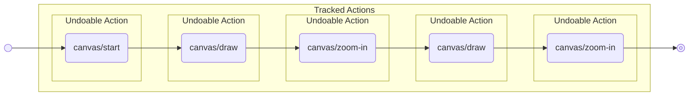
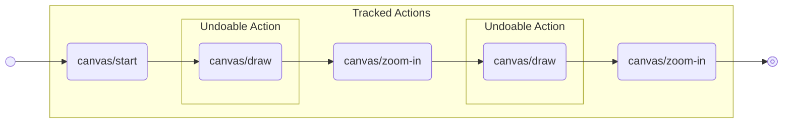
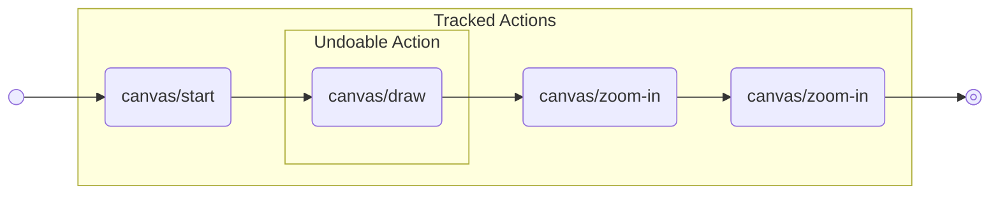
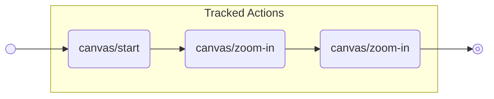
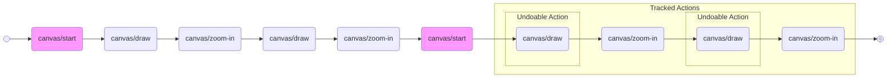

# redux-undo-actions

A different undo/redo approach for Redux, tracking actions instead of state.

## Documentation

### Simple use case



### Make only some actions undoable



After first undo



After second undo



### Custom track after action



## Development

- Install dependencies:

```bash
npm install
```

- Run the unit tests:

```bash
npm run test
```

- Build the library:

```bash
npm run build
```
